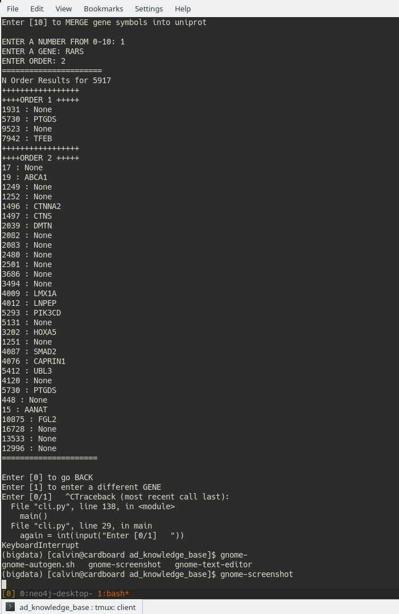
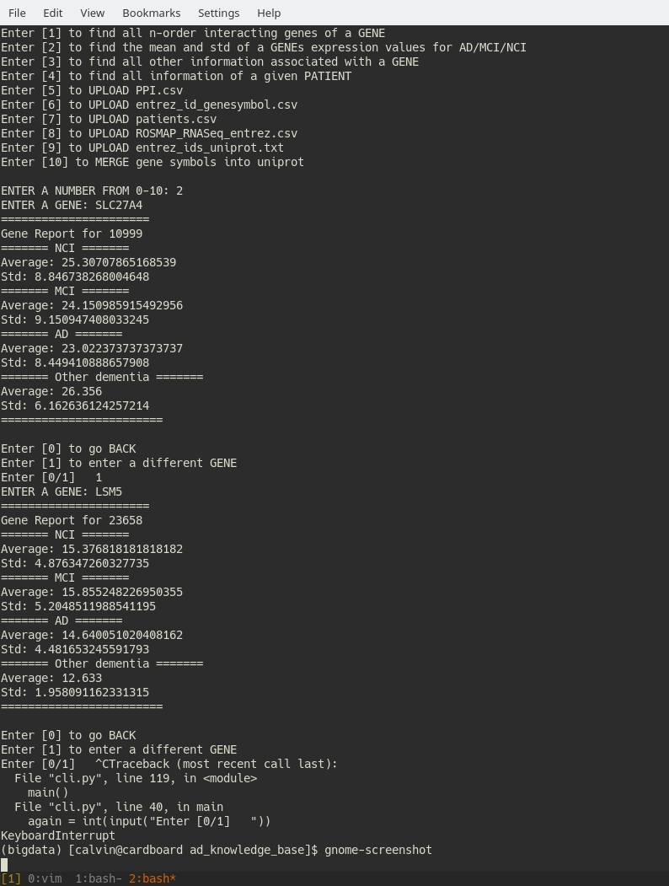
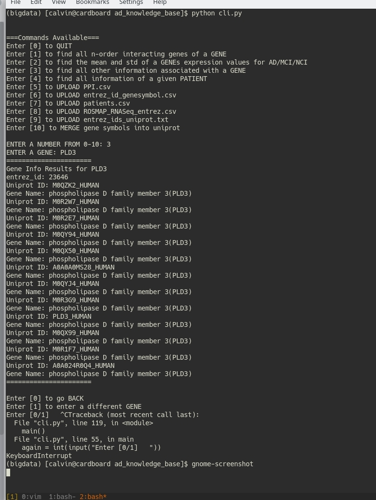
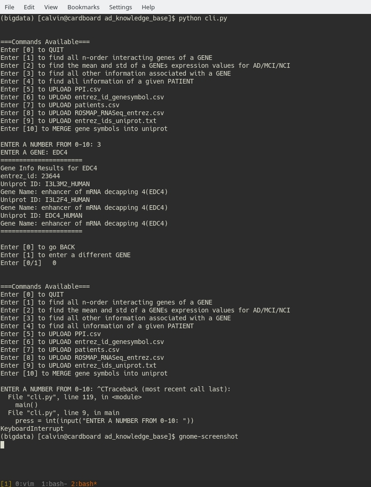
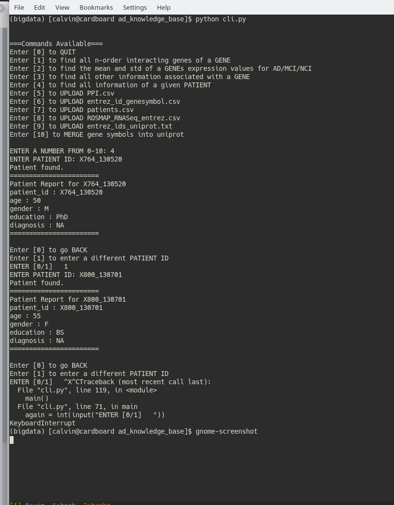

# About the project
The goal of this project is to provide an interface for the user to interact with Alzheimer Disease Knowledge Database. This interface simplifies the process of retrieving information from this knowledge base. Rather than parsing csv, xml and txt files, using this interface speeds up retrievals and provides a set of function to query the knowledge databases.

The command line interface provides a set of general commands:
 - Retrieve the gene symbols that interacting with the given gene
 - Retrieve the mean and std 
 - Retrieval of gene information (entrez id, gene symbol, corresponding uniprot ids, ...)
 - Retrieve patient information
 - Upload csv, xml, and txt files (data files)

Patient information is stored onto a Cassandra keyspace. 
Gene interaction information is stored onto a Neo4J database. 
RosmapRNASeq, Gene and Uniprot information is stored onto a Mongo instance. 

The tools to upload data onto these databases are located in ```tools/```.  Instructions on how to upload the data with/without python scripts are mentioned below.

The command line interface is ```cli.py```

The available commands are listed below.
## Setup
1. Create a virtual environment for this project. [link to instructions](http://virtualenvwrapper.readthedocs.io/en/latest/command_ref.html)
```
mkvirtualenv <ve name> 
workon <ve name>
```
2. Install the python requirements for this project
```
pip install -r requirements.txt
```
3. Skip this step if you already have the databases setup. If not, I will be assumming that you have mongodb  apache cassandra, and neo4j desktop installed. Download and installation instructions detaield here:
[Mongodb](https://docs.mongodb.com/manual/tutorial/install-mongodb-on-linux/)
[Cassandra](http://cassandra.apache.org/download/)
[Neo4J](https://neo4j.com/docs/operations-manual/current/installation/linux/tarball/)
**Note**: I recommend you use Neo4J desktop version. Deploying a local database is easier.

4. Setup the database configs for Mongo,Cassandra, and Neo4J. In the ```configs.py``` file. Edit the config functions to match your database configs.
5. In the ```data/``` folder at the root of this project, put all csv, xml, and txt files that are required for this project.
6. To perform uploads rerfer to upload instructions below.
7. To start the command line interface launch the cli file in the project directory:
```pythom -m cli```

## Quickstart

 1. Follow setup instruction (steps 1-5)
 2. To upload, from the root directory of this project
 ```
 #Uploads patients.csv
python -m adkb.tools.upload_patients 

#Uploads interactors (should take ~2 mins depending on your machine
python -m adkb.tools.upload_interactors 

#Upload ROSMAP_RNASeq_entrez.csv, may take some time depending on your machine
python -m adkb.tools.upload_rnaseq 

#Upload entrez_id_genesymbol.csv
python -m adkb.tools.upload_gene

#Upload entrez_ids_uniprot.txt 
python -m adkb.tools.upload_uniprot

#Merge gene symb attribute into uniprot collection, will take ~10mins
python -m adkb.tools.merge_uniprot_gene  
```
3. Launch the CLI in the project directory
```python -m cli```

## Project Structure
```
ad_knowledge_base/
	__init__.py
	adkb.py 					#The interface module
	cli.py						#The command line interface
	configs.py					#Database configs
	models/						#Model used by Cassandra database
		__init__.py
		patient.py
	tools/
		__init__.py
		upload_patients.py		#Upload script for patients.csv
		upload_rnaseq.py		#Upload script for ROSMAP_RNASeq_entrez.csv
		upload_gene.py			#Upload script for entrez_ids_genesymbol.csv
		upload_interactors.py	#Upload script for PPI.csv
		upload_uniprot.py		#Upload script for entrez_id_uniprot.txt
		merge_uniprot_gene.py	#Script to add gene_symbol attribute into uniprot documents
	data/ 						#Add all csv,xml,and txt files here
```

## To upload data onto the databases
### Using python scripts
From the root directory, ad_knowledge_base/, the following commands will upload data their databases
```python -m adkb.tools.upload_*```
Note: do not include the py extension when running the upload command.
### Using native NoSQL commands
#### Mongo ```(entrez_ids_uniprot.txt, ROSMAP_RNASeq_entrez.csv, uniprot-human.xml)```

From the command line:
```
./mongoimport -d collection -c uniprot --type tsv --file <file/to/entrez_ids_uniprot.txt> --headerline
```
#### Cassandra```(patients.csv)```
Run ```./cqlsh``` and in the shell:
```
CREATE KEYSPACE patient_info
  WITH REPLICATION = { 
   'class' : 'SimpleStrategy', 
   'datacenter1' : 1 
} ; 
CREATE TABLE patient ( 
   patient_id text PRIMARY KEY,
   age int,
   education text,
   gender text
) ;
COPY patient_info.patient FROM '<RELATIVE PATH TO CSV>/patients.csv' WITH HEADER=true;
```
#### Neo4J```(PPI.csv)```

In the neo4j conf file, disable the following line by adding a comment or setting the value to false. This will allow you to provide an absolute path to upload the csv.
```#dbms.directories.import=import```

If you did not disable this feature, you will have to put the csv file into the import folder of the database folder.

To upload **PPI.csv**,assuming you have turned off the feature
```
	USING PERIODIC COMMIT
	LOAD CSV FROM 'file:///<abspath/to/csv>/PPI.csv' AS row#alternatively file:///PPI.csv

	MERGE(p1:interactor {name: row[0]})
	MERGE(p2:interactor {name: row[1]})
	MERGE((p1)-[:INTERACTS_WITH]->(p2));
```


## To run the command line interface
From ad_knowledge_base/ the following command will run a cli program to query the databases.
```python -m cli```

## Data Flow/Structure


## Sample Usage
Show case the use of querying n order interactions


Show case the use of querying the mean and std of gene expressions


Show case the use of querying for all other inforamtion about a gene




Show case the use of querying patient information


